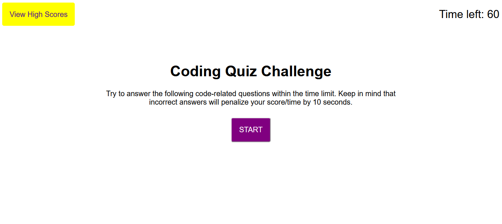

# Javscript Code Quiz

## Directions
This is a single page application built with HTML, CSS, and Javascript. It's designed to build understanding of Javascript fundamentals. The quiz uses the Web API to dynamically generate questions and provide the user with responses. It uses local storage to store the high scores of the user.

## Usage

Screenshot

This project is designed to test the user's understanding of Javascript fundamentals and compare their level of understanding to other users. The user is asked a series of questions on the fundamentals of Javascript. They have 60 seconds to answer all the questions, and any questions answered incorrectly will cost the user 10 seconds. When the user finishes, if they have time left they're asked for their initials, which are saved. 

## Credits

This concept was inspired by a project for the U of M coding bootcamp.